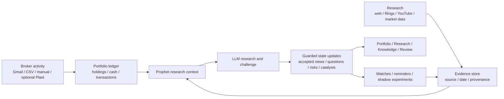

# Prophet

Prophet is a personal investment intelligence system that autonomously
researches companies, markets, events, sources, and portfolio exposures;
maintains a persistent, time-aware model of evidence and views; continuously
identifies what changed and what matters; challenges and verifies its own
conclusions; tests ideas through simulation without real trading; and learns
from later outcomes.

It’s designed to give one investor the research depth, institutional memory,
portfolio context, skepticism, and continuous monitoring of a small investment
firm—without placing trades or moving money.

Unlike a generic chat assistant, Prophet maintains research state across
sessions. Unlike a broker, it never places real orders. The LLM organizes and
challenges evidence; deterministic services own portfolio truth, calculations,
timestamps, and guarded state transitions. Private model chain-of-thought is not
exposed.

## What Prophet Does

- Reconstructs holdings from deterministic transaction records and optional
  broker-confirmation ingestion.
- Preserves research evidence with source lineage and event, publication, and
  ingestion times.
- Maintains one current accepted view per subject, separate from the evidence,
  analyses, and unresolved questions that support or challenge it.
- Connects holdings to fundamentals, investor expectations, peers, themes,
  historical analogies, contradictions, and portfolio-level transmission paths.
- Runs bounded research, verification, monitoring, reminders, integrity review,
  and source-learning workflows in the background.
- Surveys an operator-defined investable universe assembled manually or from
  tracked positions, researched entities, and latest stored benchmark snapshots,
  for provisional opportunities,
  then evaluates immutable discovery-time hypotheses against dated market and cash controls,
  exposing coverage, assumptions, evidence, skips, failures, and provider cost.
- Tests ideas through shadow experiments and paper accounts, then records
  outcomes and lessons without sending real orders.

## How It Works



The model can organize evidence, propose hypotheses, and identify weak points.
It cannot directly rewrite portfolio truth or promote unsupported claims into
accepted state.

> **Experimental software:** Prophet is not investment advice. Its data and
> analysis may be incomplete or incorrect; verify important evidence and
> decisions independently.

## Run Locally

Requirements:

- Python 3.11-3.14
- [Poetry](https://python-poetry.org/docs/#installation) 2.3.2, installed in
  its own environment (prefer `pipx install poetry==2.3.2`)
- Node.js 24 LTS and npm
- Docker with Compose, or an existing reachable PostgreSQL 16 server

Start Prophet from the repository root:

```bash
python scripts/prophet.py
```

On Windows, use `py -3.11 scripts\prophet.py`. The same command handles first
run and ordinary startup: it checks prerequisites, creates a private `.env`
with a generated local database password when needed, reuses the configured
PostgreSQL server or starts the local Compose service when none is listening,
installs lockfile-pinned dependencies, applies migrations, rebuilds changed
frontend code, waits for readiness, and opens [Prophet](http://127.0.0.1:3000).
It never installs or starts Ollama or another model provider.

Keep the launcher window open while using Prophet. Press `Ctrl+C` there to stop
the backend and frontend processes it started; PostgreSQL remains available for
the next run. Diagnose setup or inspect a running stack with:

```bash
python scripts/prophet.py doctor
python scripts/prophet.py status
```

Use `python scripts/prophet.py --dev` for frontend hot reload. The launcher will
not kill an unknown process when ports 3000 or 8000 are occupied; it reports the
conflict so the owning process can be handled deliberately. Logs live in the
ignored `.prophet-local/runtime/` directory.

The production frontend includes an installable web-app manifest. On a secure
origin, use the browser's **Add to Home Screen** or **Install app** action to run
Prophet in a standalone window. Offline navigation shows an explicit unavailable
state; Prophet does not cache portfolio, research, chat, or API data for offline
use. The default launcher remains loopback-only, so installation on another
device requires a separately secured private HTTPS access path rather than
exposing ports 3000 or 8000 to the LAN or public internet.
See [Private access](docs/private-access.md) for the supported Tailscale Serve
boundary, exact operator-identity gate, configuration, and threat model.

Do not install Poetry into `backend/.venv`; Poetry must remain isolated from the
environment it manages. The older `dev_up.sh`, `stable_up.sh`, and status
commands remain as macOS/Linux compatibility aliases, but delegate to the same
launcher rather than maintaining a second service-orchestration path.

The API health endpoint is `http://127.0.0.1:8000/health`. If the database port
is already in use, set another loopback `POSTGRES_PORT` in the private `.env`
before retrying.

Configure model and research integrations from **Settings > Research**.
Prophet's implemented LLM provider registry currently contains:

- **NVIDIA NIM (Cloud):** uses an API key and supports a configurable hosted
  model and base URL. Streaming is supported.
- **Codex CLI:** uses an installed and authenticated Codex CLI. Prophet does not
  manage an API key, model, or base URL for this adapter. Streaming is not
  supported.
- **Ollama (Local):** supports a configurable local model and base URL, plus
  streaming. It remains unavailable unless the operator explicitly enables
  local-provider use with `LLM_ALLOW_LOCAL_PROVIDER=true`; Prophet never starts
  Ollama.

External source discovery is separate from the LLM and from Prophet's stored
retrieval system. Prophet can query an operator-supplied **SearXNG** endpoint
first and use **Tavily** as a metered fallback. Search results identify candidate
pages; Prophet attempts to fetch the underlying page through its outbound URL
safety policy before creating evidence. Prophet neither installs nor starts
SearXNG. Tavily is a search provider, not an LLM provider or RAG system.

The settings UI stores configured secrets in an ignored mode-0600 sidecar and
only returns key-presence flags. Environment-based deployments may instead set
`NVIDIA_API_KEY` and `TAVILY_API_KEY`. SearXNG endpoint and provider order are
runtime settings; an optional local Tavily credit budget can bound fallback use.

YouTube ingestion reads an individual video's existing captions first, then
assesses what material questions remain unresolved. A bounded deeper pass can
verify a specific claim through the normal research pipeline or, when explicitly
enabled, use separately installed `yt-dlp`, `ffmpeg`, and the OpenAI Whisper CLI
for missing or materially incomplete speech. A separately enabled Tesseract
adapter can sample bounded frames when on-screen text is material. Raw media
stays in disposable temporary workspaces and is removed after extraction.
Neither OCR nor speech transcription implies complete visual understanding.

With `yt-dlp` installed, automation periodically reviews operator-trusted
YouTube channel sources. New-upload metadata is first stored as a provisional
discovery observation, not evidence. A bounded number of unseen uploads then
enter the same caption-first pipeline and remain attributed to the tracked
channel. Channel review and automatic ingestion are independently bounded and
configurable in `.env.example`.

## Verification

<details>
<summary>Run the complete local check suite</summary>

```bash
cd backend
poetry run coverage run --branch --source=investos -m pytest -q
poetry run coverage report --precision=1 --fail-under=40
poetry run alembic check
poetry run black --check investos tests ../scripts
poetry run isort --check-only investos tests ../scripts
poetry run flake8 investos tests ../scripts --select=E9,F63,F7,F82
poetry run bandit -q -r investos -ll
poetry run python ../scripts/repository_policy_check.py
poetry run python ../scripts/audit_python_lock.py
poetry run python ../scripts/audit_state.py

cd ../frontend
npm run lint
npm run build
npm audit --audit-level=low
```

</details>

The backend suite includes synthetic characterization tests for high-risk
user-visible behavior. Credentialed Gmail/Plaid flows and browser visual
regressions still require live external verification.

## Data and Secrets

Do not commit `.env`, `data/`, backups, runtime settings, secret sidecars,
mailbox data, broker statements, media workspaces, local agent or tool state, or
logs. The root `.gitignore` and `.dockerignore` exclude these categories.
The ongoing repository-policy check rejects private runtime or machine-local
artifacts that are eligible for commit. Gitleaks performs credential scanning in
CI across the repository history. Rotate any credential that was exposed
outside its intended secret store.

The application is local-first and has no multi-user authentication boundary.
Do not bind it to a public interface or deploy it as a shared service without
adding authentication, authorization, CSRF protection, and a deployment threat
model.

## Documentation

- [Architecture](docs/architecture.md): current components, data flow, and invariants
- [Limitations](docs/limitations.md): important operational and quality boundaries
- GitHub Issues: reproducible bugs and proposed improvements

The Python package retains the historical name `investos`; the product name is
Prophet.

## Source Availability

**Copyright (c) 2026 Eric Wang. All rights reserved.** Prophet is a personal,
source-available project, not an open-source product or commercial service.
You may inspect, clone, run, and modify it locally for personal, non-commercial
evaluation, study, and experimentation.

Commercial use, redistribution, resale, sublicensing, hosted services, and
incorporation into other products require separate written permission. See
[LICENSE.md](LICENSE.md) for the complete terms, [CONTRIBUTING.md](CONTRIBUTING.md)
before proposing changes, and [SECURITY.md](SECURITY.md) for security reporting
and runtime boundaries.
