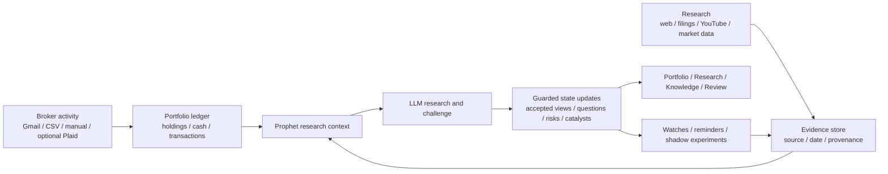

# Prophet

Prophet is a personal investment intelligence system that autonomously
researches companies, markets, events, sources, and portfolio exposures;
maintains a persistent, time-aware model of evidence and views; continuously
identifies what changed and what matters; challenges and verifies its own
conclusions; tests ideas through simulation without real trading; and learns
from later outcomes.

It’s designed to give one investor the research depth, institutional memory,
portfolio context, skepticism, and continuous monitoring of a small investment
firm—without placing trades or moving money.

Unlike a generic chat assistant, Prophet maintains research state across
sessions. Unlike a broker, it never places real orders. The LLM organizes and
challenges evidence; deterministic services own portfolio truth, calculations,
timestamps, and guarded state transitions. Private model chain-of-thought is not
exposed.

## What Prophet Does

- Reconstructs holdings from deterministic transaction records and optional
  broker-confirmation ingestion.
- Preserves research evidence with source lineage and event, publication, and
  ingestion times.
- Maintains one current accepted view per subject, separate from the evidence,
  analyses, and unresolved questions that support or challenge it.
- Connects holdings to fundamentals, investor expectations, peers, themes,
  historical analogies, contradictions, and portfolio-level transmission paths.
- Runs bounded research, verification, monitoring, reminders, integrity review,
  and source-learning workflows in the background.
- Surveys an operator-defined investable universe assembled manually or from
  tracked positions, researched entities, and latest stored benchmark snapshots,
  for provisional opportunities,
  then evaluates immutable discovery-time hypotheses against dated market and cash controls,
  exposing coverage, assumptions, evidence, skips, failures, and provider cost.
- Tests ideas through shadow experiments and paper accounts, then records
  outcomes and lessons without sending real orders.

## How It Works



The model can organize evidence, propose hypotheses, and identify weak points.
It cannot directly rewrite portfolio truth or promote unsupported claims into
accepted state.

> **Experimental software:** Prophet is not investment advice. Its data and
> analysis may be incomplete or incorrect; verify important evidence and
> decisions independently.

## Run Locally

Requirements:

- Python 3.11-3.14
- [Poetry](https://python-poetry.org/docs/#installation) 2.3.2, installed in
  its own environment (prefer `pipx install poetry==2.3.2`)
- Node.js 24 LTS and npm
- Docker with Compose

```bash
cp .env.example .env
# Set POSTGRES_PASSWORD in .env before starting PostgreSQL. If port 5432 is
# already in use, choose another loopback port with POSTGRES_PORT.
docker compose up -d db

cd backend
poetry config virtualenvs.in-project true --local
poetry install --with dev
poetry run alembic upgrade head
cd ../frontend
npm ci
cd ..

```

Do not install Poetry into `backend/.venv`; Poetry must remain isolated from the
environment it manages.

Start the services in separate terminals on any supported platform, including
Windows:

```bash
cd backend
poetry run uvicorn investos.main:app --host 127.0.0.1 --port 8000
```

```bash
cd frontend
npm run dev -- --hostname 127.0.0.1 --port 3000
```

On macOS or Linux, `./scripts/dev_up.sh` and `./scripts/dev_status.sh` provide a
convenience wrapper around detached `screen` sessions. They are optional and are
not the cross-platform runtime contract.

Open [Prophet](http://127.0.0.1:3000). The API health endpoint is
`http://127.0.0.1:8000/health`.

Configure model and research integrations from **Settings > Research**.
Prophet's implemented LLM provider registry currently contains:

- **NVIDIA NIM (Cloud):** uses an API key and supports a configurable hosted
  model and base URL. Streaming is supported.
- **Codex CLI:** uses an installed and authenticated Codex CLI. Prophet does not
  manage an API key, model, or base URL for this adapter. Streaming is not
  supported.
- **Ollama (Local):** supports a configurable local model and base URL, plus
  streaming. It remains unavailable unless the operator explicitly enables
  local-provider use with `LLM_ALLOW_LOCAL_PROVIDER=true`; Prophet never starts
  Ollama.

External source discovery is separate from the LLM and from Prophet's stored
retrieval system. Prophet can query an operator-supplied **SearXNG** endpoint
first and use **Tavily** as a metered fallback. Search results identify candidate
pages; Prophet attempts to fetch the underlying page through its outbound URL
safety policy before creating evidence. Prophet neither installs nor starts
SearXNG. Tavily is a search provider, not an LLM provider or RAG system.

The settings UI stores configured secrets in an ignored mode-0600 sidecar and
only returns key-presence flags. Environment-based deployments may instead set
`NVIDIA_API_KEY` and `TAVILY_API_KEY`. SearXNG endpoint and provider order are
runtime settings; an optional local Tavily credit budget can bound fallback use.

YouTube ingestion uses an individual video's existing captions first. For a
video without captions, an optional free local fallback can use separately
installed `yt-dlp`, `ffmpeg`, and the OpenAI Whisper CLI. It is disabled by
default and must be enabled with `YOUTUBE_LOCAL_TRANSCRIPTION_ENABLED=true`.
Downloads stay in bounded temporary workspaces and raw media is removed after
transcript extraction. This path transcribes speech; it does not inspect charts,
slides, expressions, or other video frames. See `.env.example` for its operator
settings. When `yt-dlp` is installed, Sources can also show a bounded,
metadata-only review of recent uploads from a tracked YouTube channel. Prophet
does not crawl or ingest the channel automatically; a selected video follows the
same caption-first ingestion path and remains attributed to that channel source.

## Verification

<details>
<summary>Run the complete local check suite</summary>

```bash
cd backend
poetry run coverage run --branch --source=investos -m pytest -q
poetry run coverage report --precision=1 --fail-under=40
poetry run alembic check
poetry run black --check investos tests ../scripts
poetry run isort --check-only investos tests ../scripts
poetry run flake8 investos tests ../scripts --select=E9,F63,F7,F82
poetry run bandit -q -r investos -ll
poetry run python ../scripts/repository_policy_check.py
poetry run python ../scripts/audit_python_lock.py
poetry run python ../scripts/audit_state.py

cd ../frontend
npm run lint
npm run build
npm audit --audit-level=low
```

</details>

The backend suite includes synthetic characterization tests for high-risk
user-visible behavior. Credentialed Gmail/Plaid flows and browser visual
regressions still require live external verification.

## Data and Secrets

Do not commit `.env`, `data/`, backups, runtime settings, secret sidecars,
mailbox data, broker statements, media workspaces, local agent or tool state, or
logs. The root `.gitignore` and `.dockerignore` exclude these categories.
The ongoing repository-policy check rejects private runtime or machine-local
artifacts that are eligible for commit. Gitleaks performs credential scanning in
CI across the repository history. Rotate any credential that was exposed
outside its intended secret store.

The application is local-first and has no multi-user authentication boundary.
Do not bind it to a public interface or deploy it as a shared service without
adding authentication, authorization, CSRF protection, and a deployment threat
model.

## Documentation

- [Architecture](docs/architecture.md): current components, data flow, and invariants
- [Limitations](docs/limitations.md): important operational and quality boundaries
- GitHub Issues: reproducible bugs and proposed improvements

The Python package retains the historical name `investos`; the product name is
Prophet.

## Source Availability

**Copyright (c) 2026 Eric Wang. All rights reserved.** Prophet is a personal,
source-available project, not an open-source product or commercial service.
You may inspect, clone, run, and modify it locally for personal, non-commercial
evaluation, study, and experimentation.

Commercial use, redistribution, resale, sublicensing, hosted services, and
incorporation into other products require separate written permission. See
[LICENSE.md](LICENSE.md) for the complete terms, [CONTRIBUTING.md](CONTRIBUTING.md)
before proposing changes, and [SECURITY.md](SECURITY.md) for security reporting
and runtime boundaries.
