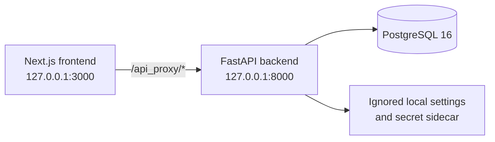
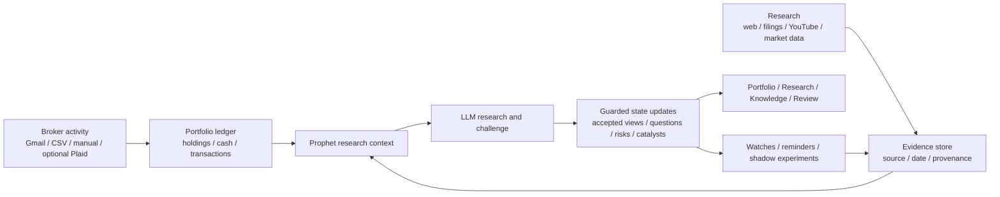

# Prophet Architecture

This document describes the repository as it exists today. It is intentionally
smaller than the historical design plan that preceded the implementation.
Source code, migrations, and tests remain authoritative when this document and
the implementation disagree.

## Scope

Prophet is a local-first, single-user investment intelligence system. It
combines a deterministic portfolio ledger with dated evidence, persistent
research state,
model-assisted analysis, guarded belief updates, monitoring, and simulated
decisions. It does not connect to a live execution venue or place real orders.

Two application processes and one database make up the normal runtime:



The frontend rewrite is configured in `frontend/next.config.ts`. FastAPI mounts
all application routers under `/api` in
`backend/investos/api/routes/__init__.py`. The backend rejects non-loopback API
clients by default and restricts browser state changes to configured frontend
origins. This is a local safety boundary, not multi-user authentication.

## End-to-End Data Flow



The two left-hand lanes have different truth rules. Portfolio quantities and
cash are reconstructed by deterministic services. Research enters as evidence
with provenance and is not accepted merely because a model produced it.

## Inputs

### Portfolio activity

`api/routes/portfolio.py` exposes manual transactions, CSV/text imports,
position reconciliation, corrections, and research-object creation.
`services/portfolio.py` and `services/transaction_provenance.py` own ledger
replay and source receipts. `services/mailbox.py` parses scoped Gmail or IMAP
broker messages, including supported corrections and corporate actions. The
optional Plaid path is isolated behind `services/brokerage.py` and integration
routes.

The model may help classify an ambiguous document, but it cannot directly set
positions, cash, fills, or prices. Those values are accepted only through the
portfolio and reconciliation services.

### Research and market evidence

`api/routes/ingestion.py` accepts notes, files, and URLs. Research discovery and
extraction run through `services/research.py`, `workers/research.py`, and
`workers/extraction.py`. The Sources routes and services manage provenance,
feedback, ownership disclosures, market-setup signals, fundamental metrics,
and YouTube transcript workflows. Market prices and benchmark context are
handled separately by the market-data and risk services.

External web discovery runs through a provider registry. A configured SearXNG
endpoint is the free-first path; configured Tavily is a metered fallback when
the earlier provider fails or returns no usable candidates. A successful first
provider stops the chain. Search snippets remain provisional: research ingestion
fetches the underlying page through `core/url_security.py` when possible and
records discovery provider, source URL, content origin, and fallback attempts.
Neither search provider is Prophet's retrieval system. YouTube ingestion uses
available captions or an explicitly supplied transcript. The current media
boundary is documented in `limitations.md`.

## Durable State

PostgreSQL is the source of durable application state. SQLAlchemy models live in
`backend/investos/models/`, and Alembic migrations live in
`backend/alembic/versions/`.

The main state groups are:

- **Portfolio truth:** `Transaction`, `Lot`, `Position`, and cash-ledger records.
- **Evidence and provenance:** `Source`, `RawEvidence`, `SourceItem`, source
  profiles, quality segments, and source-performance history.
- **Structured knowledge:** `Fact`, `Claim`, `Event`, `FundamentalMetric`,
  `MarketSetupSignal`, `Entity`, `Theme`, aliases, and graph `Edge` records.
- **Research state:** `Profile`, `CoverageMap`, unresolved questions,
  `EvidencePacket`, `ReasoningRun`, `CritiqueRun`, and review-queue items.
- **Accepted belief:** `ConclusionState` plus an append-only sequence of
  `ConclusionRevision` records.
- **Monitoring and learning:** `ActiveWatcher`, decisions, verification runs,
  lessons, historical episodes, and source outcomes.
- **Opportunity discovery:** operator-selected universe members, resumable
  coverage/cost runs, and reviewable source-linked candidates whose assumptions
  remain separate from evidence.
- **Simulation:** shadow experiments, account events, orders, fills, evidence
  wake-ups, results, and experiment-family learning state.

Evidence models use event, publication, ingestion, and eligible-action times
from `models/base.py`. These timestamps preserve what happened, when it became
public, when Prophet learned it, and when it could have influenced a simulated
action.

## Retrieval and Reasoning

The primary interactive path is `POST /api/agent/turn`, with a persistent job
variant for work that continues outside the request. `services/agent.py`
resolves the subject and requested operation. `services/retrieval.py` assembles
a bounded packet from direct evidence, connected evidence, contradictions,
historical analogies, lessons, source feedback, portfolio exposure, peers, and
cached risk context. Fresh external research may be requested when the stored
packet is stale or insufficient.

All model calls go through `backend/investos/core/llm.py` and the provider
capability registry in `core/providers.py`. The default path uses a hosted
provider. Local providers remain disabled unless explicitly enabled; Prophet
does not start Ollama or another local model process.

Model output is treated as a proposal. `services/reasoning.py` records the
analysis result and visible trace. `services/corroboration.py`,
`services/canonical_state.py`, inference policy, coverage state, and
`services/verification.py` decide whether a proposal can affect accepted state.
Material contradictions, unsupported assertions, weak source independence, or
unresolved evidence gaps can narrow or block promotion.

## Accepted State and Graph

`ConclusionState` is the current accepted view for a subject. Evidence packets,
chat answers, profiles, and reasoning runs support or challenge that view but do
not replace it. Revisions retain history so an updated view does not erase how
the earlier conclusion was formed.

The knowledge graph is a retrieval and inspection structure over subjects,
evidence, claims, themes, positions, and explicit relationships. Graph registry,
edge-state, alias, integrity, pruning, and mutation-audit services keep graph
changes inspectable. The graph does not grant truth status to a connected node;
state promotion still passes through evidence policy.

## Automation

`AutomationCoordinator` starts with the FastAPI lifespan and registers the
background operating jobs. Static and runtime settings determine which jobs are
enabled and their intervals. The implemented jobs cover:

- research and unresolved-question processing;
- evidence extraction and source-claim assessment;
- integrity, entity, theme, relation, and media cleanup;
- market prices, risk, fundamental freshness, and historical reindexing;
- Gmail sync and optional brokerage reconciliation;
- reflection, strategist, pattern-discovery, and watcher cycles;
- bounded opportunity-universe research and candidate evaluation;
- shadow discovery, paper-account refresh, and evidence wake-ups;
- database backup and job telemetry.

Jobs call the same domain services used by the API. Automation is not a bypass
around portfolio truth or accepted-state policy.

## Frontend Surfaces

The Next.js App Router pages under `frontend/src/app/` expose the implemented
workflows:

- **Portfolio and History:** holdings, transactions, corrections, and account
  history.
- **Research:** persistent conversations, live jobs, evidence, and agent action
  traces.
- **Feed and Activity:** dated research changes and background work.
- **Knowledge and Profiles:** graph exploration, subject dossiers, aliases, and
  source receipts.
- **Sources:** trusted and discovered sources, evidence, feedback, disclosures,
  metrics, and media capabilities.
- **Risk and Review:** concentration, attribution, benchmarks, verification, and
  review queues.
- **Experiments:** shadow theses, paper accounts, orders, fills, checkpoints,
  outcomes, and learning state.
- **Settings:** connector configuration, provider readiness, setup state, and
  automation status.

`frontend/src/lib/api.ts` is the typed client boundary. Shared navigation lives
in `frontend/src/components/AppNav.tsx`.

## Configuration and Secrets

`backend/investos/config.py` defines static environment settings. User-editable
provider and integration settings are layered by
`services/runtime_settings.py`. The default local settings file and its secret
sidecar live under the ignored `data/` directory. API responses expose readiness
and key-presence flags, not secret values.

The checked-in `.env.example` contains placeholders only. Runtime settings,
portfolio data, evidence, media workspaces, databases, backups, logs, and local
agent state are not part of the repository.

## Invariants

The following boundaries are intentional and should remain true as the system
evolves:

1. Portfolio truth, calculations, timestamps, and simulated fills are
   deterministic and auditable.
2. Raw evidence retains source lineage and time semantics.
3. The LLM organizes, investigates, and challenges; it is not a truth store.
4. Repeated copies from one publisher do not become independent confirmation.
5. Material unsupported claims cannot upgrade accepted state.
6. Exploration and historical analogies remain provisional until tested.
7. Provider failure cannot invent a trade, portfolio, evidence item, or
   successful state transition.
8. Shadow and paper workflows never place real orders.
9. Private runtime state and credentials remain outside Git.
10. The application remains loopback-only unless a separate authenticated
    deployment design is implemented and reviewed.

## Repository Map

```text
backend/investos/api/routes/  HTTP boundaries
backend/investos/models/      durable database models
backend/investos/schemas/     request and response contracts
backend/investos/services/    domain behavior and policy
backend/investos/workers/     research and extraction workers
backend/alembic/              database migrations
backend/tests/                synthetic backend regressions
frontend/src/app/             user-facing routes
frontend/src/components/      shared workflow components
frontend/src/lib/             API client and frontend helpers
scripts/                      development, verification, and operator tools
docs/                         current public contracts and limitations
```

The product name is Prophet. The Python package and default database retain the
historical name `investos`.

## Known Boundaries

Architecture describes implemented structure, not guaranteed analytical
quality. External data availability, model quality, connector coverage, test
depth, and simulation fidelity have explicit limits. See
[`limitations.md`](limitations.md) for the current boundary.
